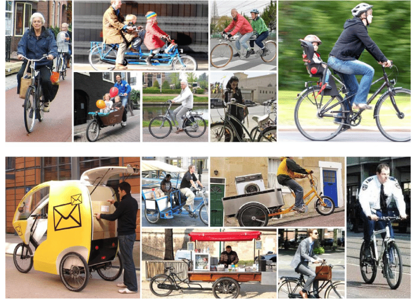

# Demographic Insights and Purchase Pattern in the Bike Market

___

## Table of Contents

-[Introduction](#introduction)

-[Data Source](#data-source)

-[Tool(s)](#tools)

-[Excel Skills Applied](#excel-skills-applied)

-[Problem Statement](#problem-statement)

-[Data Analysis and Visualization](#data-analysis-and-visualization)

-[Results/Findings](#resultsfindings)

-[Recommendations](#recommendations)

## Introduction
This Project provides insights into the sales performance of a bike Company. The dataset is centered on demographic characteristics of the consumer and the impact on bike purchasing behaviour.
Businesses across industries always seek to gain insight into consumer behavior so as to stay competitive and meet evolving consumer needs. Bike industry is no exception. 
Bike Industry is known for its diversity and innovation. Hence, there is a need to understand the underlying factors that drive purchasing decisions so as to be able to make data-driven recommendations which would attract prospective buyers and retain the existing customers.

## Data Source
The dataset used for this analysis is in Excel xls.file. It is a **_dummy_** data, gotten on the internet and downloaded. It contains 1027 rows and 13 columns.

The dataset can be downloaded [Here](https://github.com/Rolakamin/Project_Documentation/blob/main/Dataset.xlsx)

The cleaned dataset can be downloaded [Here](https://github.com/Rolakamin/Project_Documentation/blob/main/Cleaned%20Data.xlsx)

## Tool(s)
Excel

## Excel Skills Applied
**Data Cleaning /Preparation**
1. Removal of Duplicated Data 
2. Handling missing values
3. Data Formatting
4. Created Age Brackets from Age Field using IF function
   
**Pivot Chart** — To calculate, summarize and analyze the data.

**Data visualization** – Excel Dashboard.

## Problem Statement
-  How do demographic factors such as marital status, gender, income, education, and geographical location influence bike purchasing behavior?
-  Are income level and commute distance strong predictors of bike purchases?
-  Are certain demographic groups more likely to purchase bikes than others?
-  Are there differences in bike purchasing behavior across different regions? Which region has high bike purchasing potential?
-  Are married individuals with children more likely to purchase bikes compared to single individuals without children?
-  What are the characteristics of individuals who are more likely to purchase bikes?

## Data Analysis and Visualization

## Results/Findings

The analysis results as observed from the dashboard are summarized as follows:
1. Men earned more on average, with a salary of $60,124 compared to women, whose average salary was $55,774. Hence, men purchased more bikes, possibly due to their higher income.
2. Young adults(age <45) made the highest bike purchases, indicating a strong preference for bikes among them.
   Senior adults (age >65) bought the least number of bikes, indicating lower purchasing power compared to other age groups.
3. The professionals purchased the highest number of bikes compared to other occupations, highlighting their significant contribution to overall sales.
4. Sales were highest in North America Region. This indicates a strong market performance in that area .
5. The shorter the commute distance, the higher the number of bikes purchased. Conversely, the longer the commute distance, the fewer the number of bikes purchased.
6. Single individuals with children and married individuals with children made more bike purchases than those without children, regardless of marital status.

## Recommendations

Based on the analysis, we recommend the following actions:

